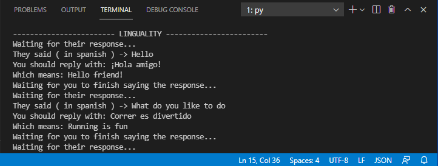
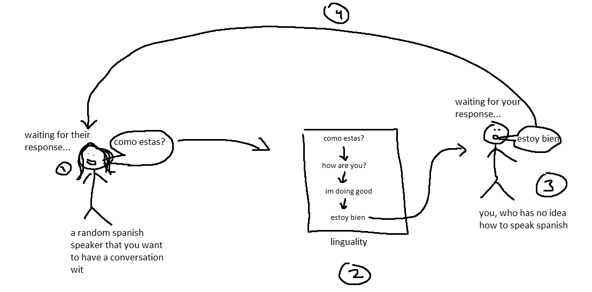

# Linguality

Linguality.py is a python application utilizing NLP tools and tecniques that allows English speakers to have a conversation in a foreign language. It records a microphone input from your conversation partner (e.g. a non-English speaker) and translates it for you to understand what they said. Once the translation is finished, it generates a response from chatbot.py using the intents.json file. This suggested response is then generated back to the conversation partner's language and outputted to the user, so the user is given a generated response to reply to their partner. Linguality built using Tensorflow (generated responses), Speech Recognition (microphone inputs and speech-to-text), Google API's (multi-lingual translations), and the PlaySound library (output and export text-to-speech files).

More information about the application found here: https://docs.google.com/document/d/13aKU7OHSp2RcD8Gapvr1gqRKvXroJ2eW5UutqXS1IcM/

Be sure to install all required modules before running!

Create a file in the root directory called ```credentials.json``` in the root directory.
This file will need to contain your Google Cloud Platform API key object.

If there is a problem with the client authorization, try running:
pip install oauth2client

Before running linguality.py, please run training.py

If you need more help running this application, please contact me at jvoprogramming@gmail.com

_________________________________________________________________________________________________

Screenshots:


